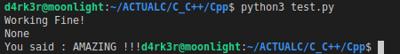

# OpenCvCpp with Conan

This is a sample project explaining how to use conan in a cpp with an external library such as openCv.

## Requirements

- python (3.x is recommended)
- pip (Install it by running sudo apt-get install python3-pip)
- C++11 (recommended)
- Conan (install it by running `pip install conan`)
- Boost C++ Python 3.7 (Install it by running : `sudo apt-get install cmake libblkid-dev e2fslibs-dev libboost-all-dev libaudit-dev`)

## Ho to test this project

#### 1- Install pre-requirements

Just run: `sh ./shells/install.sh`
What is done behind the scene:

```shell
pip install conan
```

#### 2- You need to configure your `conanfile.txt` like this sample:

Sample content :

```txt
[requires]
opencv/2.4.13.5@conan/stable

[generators]
cmake
```

you can also do a `conan search your-lib --remote=conan-center` and then select in the list what you want to use


#### 3- Config your `CMakeLists.txt`, conan-packages as follow:

The content of the file :
```txt
cmake_minimum_required(VERSION 3.12)

project(opcv)

add_definitions("-std=c++11")
find_package(Boost COMPONENTS python37 REQUIRED)
find_package(PythonInterp 3.7)
find_package(PythonLibs 3.7)

include("./build/conanbuildinfo.cmake")
conan_basic_setup()

add_library(${PROJECT_NAME} 
    SHARED
    module.cpp
    opcv.cpp)

file(
  GLOB
  headers
  *.hpp
)

target_include_directories(${PROJECT_NAME} PRIVATE ${Boost_INCLUDE_DIRS} ${PYTHON_INCLUDE_DIRS})
target_link_libraries(${PROJECT_NAME} ${Boost_LIBRARIES} ${PYTHON_LIBRARIES} ${CONAN_LIBS})

# To build an eecutable
# add_executable(${PROJECT_NAME} opcv.cpp)
target_link_libraries(${PROJECT_NAME} ${CONAN_LIBS})
set_target_properties(${PROJECT_NAME} PROPERTIES PREFIX "")

message("install ${Python_SITELIB}")
```

Now, we are set-up and we can build our sample app for streaming the camera of our laptop : 


#### 4- Check up our code :


Sample code for openCv, this is the tree :

```shell
.
├── CMakeLists.txt
├── conanfile.txt
├── MANIFEST.in
├── module.cpp
├── opcv.cpp
├── opcv.hpp
├── README.md
├── setup.py
├── shells
│   ├── build.sh
│   ├── build_whl.sh
│   ├── install_build_start.sh
│   ├── install.sh
│   └── start.sh
├── test.py
├── TO_CREATE_LIB.md
└── WHEN_WAS_NOT_WORKING.md
```


#### 5- We can now build it to get our `.so` shared library.

Just run: `sh ./shells/build.sh`
What is done behind the scene:

```shell
rm -rf build
mkdir build && cd build
conan install ..
cmake .. -G "Unix Makefiles" -DCMAKE_BUILD_TYPE=Release
cmake --build .
```

Some files will be added in `./build` + the portable of our application in `./build/bin` or the lib in `./build/lib` :-)


#### 6- if it was an executable we can run our application :

Just run: `sh ./start.sh`
What is done behind the scene:

```shell
./build/bin/----
```

#### If it was a library we want to call it in our python source code

Just run: `sh ./shells/build_whl.sh`
What is done behind the scene:

```shell
pip3 install wheel
pip3 uninstall ./dist/*
rm -rf ./dist/*
python3 setup.py bdist_wheel
pip3 install ./dist/*
```

In the Cpp sour-code we have : 

```c++
#include <iostream>
#include "opcv.hpp" 

void printt(std::string strr)
{
    std::cout << "Working Fine!" << std::endl;
    std::cout << "You said : " << strr;
}
.
.
.
```

We can call it in our python sourcode like this :

```python
from opcv import printt
print(printt("AMAZING !!!"))
```

Or just run `python3 test.py` to test it your self.

### Output



## Author

- Sanix-darker
